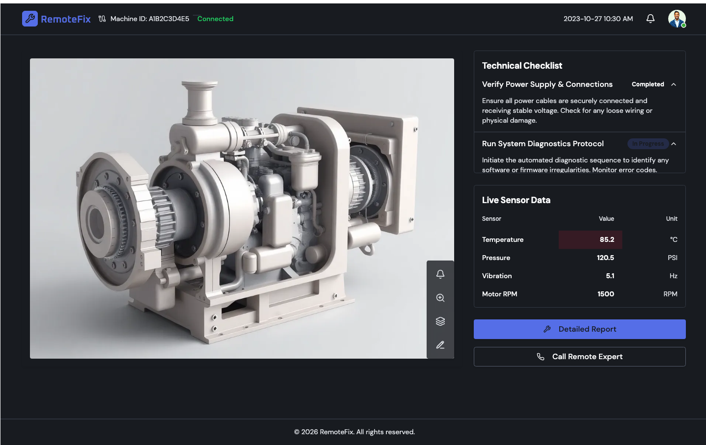
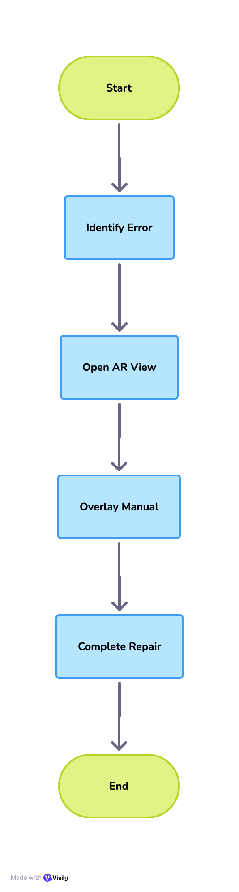

# AR-Assist Pro: Spatial UI/UX for Remote Engineering

Project Portfolio | ADVT. NO.: CORP/JIT/07/2025-MB

## 📌 Project Overview

AR-Assist Pro is a conceptual Android-based Augmented Reality (AR) application designed for high-stakes technical environments. It enables remote experts to provide real-time, spatially-anchored guidance to on-site technicians. This project showcases the intersection of Android System Integration, Spatial UI/UX Design, and AR-VR Development.

## 🎨 UI/UX Design Philosophy

Unlike traditional 2D mobile apps, this project focuses on Spatial Ergonomics. The design ensures that digital overlays do not obstruct the user's view of hazardous physical components.

### Key Design Features:

The 1.5m Focus Rule: All interactive UI panels are rendered at a comfortable focal distance of 1.5 meters to prevent eye strain (vergence-accommodation conflict).

Gaze-and-Commit Interaction: Designed for hands-free environments where users can interact with UI elements via head-gaze or voice commands.

High-Contrast "Safety" HUD: Uses a specialized color palette (High-visibility Yellow/Black) to ensure readability against complex industrial backgrounds.

### Wireframe & Interaction Flow

Detailed wireframes were developed to map the transition from a 2D mobile "Onboarding" state to a 3D "AR-Active" state.

## 🔄 User Integration Workflow

Environment Calibration: App utilizes ARCore to build a point-cloud mesh of the machine.

Expert Handshake: Low-latency video streaming begins between the Android client and the Expert web-dashboard.

Spatial Annotation: The expert "pins" 3D markers onto physical parts. These markers remain anchored even if the user moves or looks away.

IoT Integration: Real-time data (RPM, Temperature) is pulled from sensors and displayed as a floating "Digital Twin" above the hardware.

## 🛠 Technical Stack 

Platform: Android (Kotlin)

AR Engine: ARCore / SceneView

UI/UX Design: Visily / Excalidraw

Real-time Logic: MQTT for IoT data & WebRTC for video streaming

## 📂 Repository Structure

Plaintext

├── /design-assets       # Exported Wireframes and UI Layouts (PDF/PNG)

├── /src                 # Android Source Code (Activity & AR Fragment logic)

├── /docs                # Technical Design Specification & UX Logic

└── README.md            # Project Overview & Portfolio Entry

### 📱 Wireframe

This screen shows the "Expert Guidance" mode with anchored 3D annotations.

### 📱 Main Interface Workflow

## 📂 Project Documentation

For a deep dive into the UX research and technical specifications:

[📄 Download Full Design Specification (PDF)](./docs/AR_Assist_PRO.pdf)
